<h1>
Hono tRPC Example Project
</h1>

Just a demo of Hono and tRPC in a monorepo. I wanted to try this out as an alternative
to Hono's own RPC feature and compare its features. If you like Hono RPC instead, you can check out my [Hono RPC Examples](https://github.com/Blankeos/hono-rpc-examples).

The frontend can be anything, I just chose Solid + [Vike][vike-url] (for SSR) for this example.

<h2>Table of Contents</h2>

- [Architecture](#architecture)
- [Requirements](#requirements)
- [Getting Started](#getting-started)
- [Differences with Hono RPC that I noticed.](#differences-with-hono-rpc-that-i-noticed)

## Architecture

```mermaid
block-beta
    columns 4
        block:frontend:4
            columns 3
            frontendheader["Frontend"]:3
            S["🔵 Solid port:3000"]:1
            space
            S-. "SSR" .-V
            V["🔨 Vike port:3000"]:1
        end
        space:4
        block:backend:4
            columns 2
            backendheader["Backend - port:4001"]:2 H["🔥 Hono"]:1 T["🔷 tRPC"]:1
            S -. "CSR" .-> H
            V -. "SSR" .-> H
        end

  style frontendheader fill:#939,stroke:#333,stroke-width:4px,width:10px
  style backendheader fill:#386,stroke:#333,stroke-width:4px,width:10px
```



## Requirements

1. [Bun (latest)][bun-install-url]

## Getting Started

1. Install dependencies

```sh
bun install
```

2. Run the app

```sh
bun dev # Runs bun server:dev and bun client:dev
```

## Differences with Hono RPC that I noticed.

The current differences I see are:

- [x] Feature: Batch fetching with tRPC client.
  - When initializing the client, you can `httpBatchLink` to do batching.
  - You can use `httpLink` to not use batching.
- [x] Maturity: tRPC is (probably) more mature and battle-tested than Hono RPC.
- [x] Paradigm: In `trpc.ts`, you can export reusable base:
  - Routers
  - Procedures (e.g. protectedProcedure, publicProcedure) - The alternative would be to use **middlewares** for <u>controller-level</u> protection or use a **utility** for <u>endpoint-level</u> protection.
- [x] Paradigm: REST-facing is difficult unless you use `trpc-openapi`.
  - 1. because if your URL queries are always inside `?input` of the URL query (e.g. `:4000?input="Carl"`)
  - 2. If your query has multiple variables, you can't do (e.g. `?name="Carl"&age="23"`) - I have not tested this yet.
  - 3. Query Objects are always parsed as URL strings:
    - `const input = { name: "Carl" }` will be
    - `input=%7B%220%22%3A%7B%22id%22%3A%221%22%2C%22name%22%3A%22Carl%22%7D%7D`

<!-- URLS -->

[vike-url]: https://github.com/vikejs/vike-solid "Vike Solid"
[bun-install-url]: https://bun.sh/docs/installation

<!-- # hono-trpc

To install dependencies:

```bash
bun install
```

To run:

```bash
bun run index.ts
```

This project was created using `bun init` in bun v1.1.3. [Bun](https://bun.sh) is a fast all-in-one JavaScript runtime. -->
