<h1>
Hono tRPC Example Project
</h1>

Just a demo of Hono and tRPC in a monorepo.

The frontend can be anything, I just chose Solid + [Vike][vike-url] (for SSR) for this example.

<h2>Table of Contents</h2>

- [Architecture](#architecture)
- [Requirements](#requirements)
- [Getting Started](#getting-started)

## Architecture

```mermaid
block-beta
    columns 4
        block:frontend:4
            columns 3
            frontendheader["Frontend"]:3
            S["🔵 Solid port:3000"]:1
            space
            S-. "SSR" .-V
            V["🔨 Vike port:3000"]:1
        end
        space:4
        block:backend:4
            columns 2
            backendheader["Backend - port:4001"]:2 H["🔥 Hono"]:1 T["🔷 tRPC"]:1
            S -. "CSR" .-> H
            V -. "SSR" .-> H
        end

  style frontendheader fill:#939,stroke:#333,stroke-width:4px,width:10px
  style backendheader fill:#386,stroke:#333,stroke-width:4px,width:10px
```



## Requirements

1. [Bun (latest)][bun-install-url]

## Getting Started

1. Install dependencies

```sh
bun install
```

2. Run the app

```sh
bun dev # Runs bun server:dev and bun client:dev
```

<!-- URLS -->

[vike-url]: https://github.com/vikejs/vike-solid "Vike Solid"
[bun-install-url]: https://bun.sh/docs/installation

<!-- # hono-trpc

To install dependencies:

```bash
bun install
```

To run:

```bash
bun run index.ts
```

This project was created using `bun init` in bun v1.1.3. [Bun](https://bun.sh) is a fast all-in-one JavaScript runtime. -->
